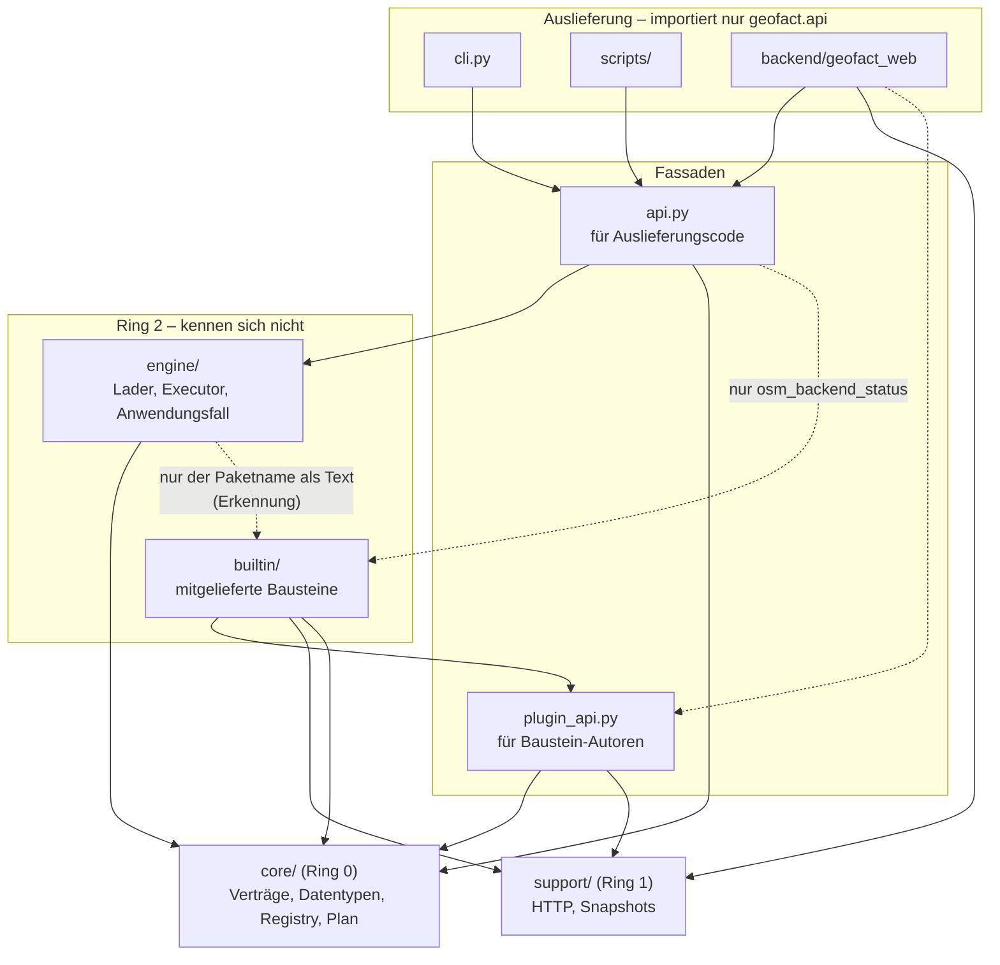

# GeoFACT – Architektur

Stand: 01.10.2026, nach dem Umbau „Architektur B“.
Dieses Dokument beschreibt den Ist-Zustand des Codes. Maßgeblich bleibt der Code; wo
dieses Dokument und der Code auseinanderlaufen, ist das Dokument zu korrigieren.

Inhalt: [Zweck](#1-zweck-und-überblick) ·
[Schichtenregel](#2-pakete-und-schichtenregel-fa45) ·
[Pakete und Module](#3-pakete-und-module) ·
[Registry](#4-die-registry-fa40) ·
[Erkennung](#5-erkennung-von-bausteinen-fa40) ·
[Baustein hinzufügen](#6-baustein-hinzufügen) ·
[Validierung](#7-validierung-fa2) ·
[Anwendungsfall](#8-der-anwendungsfall-szenario-ausführen-fa44) ·
[Plan und Lazy Loading](#9-ausführungsplan-und-lazy-loading-fa9) ·
[Executor und Ereignisse](#10-executor-ereignisse-und-warnungen) ·
[CLI](#11-kommandozeile) ·
[Web-Backend](#12-wo-das-web-backend-andockt) ·
[Grenzen](#13-bewusste-grenzen)

---

## 1. Zweck und Überblick

GeoFACT beschreibt eine räumliche Analyse als **Szenario** in YAML: Layer (Datenquellen),
Schritte (Operationen) und Ausgaben bilden einen gerichteten azyklischen Graphen (DAG).
Die Ausführungsreihenfolge folgt aus den Verweisen (topologische Sortierung), Layer werden
erst geladen, wenn ein Schritt sie braucht (Lazy Loading).

Die Architektur trennt drei Dinge, damit die Forschungsfrage der Arbeit („Wo verläuft die
Grenze zwischen generisch und domänenspezifisch?“) am Code ablesbar bleibt:

1. **Kern und Engine** kennen keinen einzelnen Baustein. Sie kennen nur *Verträge*
   (Basisklassen, Datentypen) und eine *Registry*.
2. **Bausteine** (Quellarten, Dateiformate, Tabellenformate, Transformationen,
   Operationen, Ausgabeformate) sind je eine Datei mit Vertrag **und** Implementierung.
   Mitgelieferte Bausteine (`geofact.builtin`) und externe Plugins sind technisch gleich:
   dieselben Marker und Vertragsklassen aus `geofact.plugin_api`, derselbe Lader, dieselbe Registry.
3. **Auslieferung** (Kommandozeile, Web-Backend, Skripte) ruft genau einen Anwendungsfall
   auf (`geofact.api`: laden, prüfen, planen, ausführen). Es gibt keinen zweiten Weg, ein
   Szenario auszuführen.

Eine neue Fähigkeit ist deshalb *eine neue Datei* (NFA4); bestehende Dateien werden nicht
angefasst. Die Schichtenregel, die das sicherstellt, ist ein Test (FA45), keine Konvention.

---

## 2. Pakete und Schichtenregel (FA45)



Pfeil = „importiert“. Durchgezogen: im Code vorhanden. Gestrichelt: erlaubt, aber nur
wie beschriftet bzw. derzeit ungenutzt.

**Abhängigkeitsregel:** Ein Paket darf nur nach unten importieren, die beiden Pakete von
Ring 2 (`engine`, `builtin`) kennen einander nie. `core` ist rein: keine
Infrastrukturbibliothek, kein Lesen von Dateien, kein Netz.

`tests/unit/test_architecture_layers.py` erzwingt das mit `ast` über die Quelltexte (keine
Zusatzabhängigkeit wie `import-linter`; Importe unter `if TYPE_CHECKING:` zählen nicht).
Alle zehn Regeln sind scharfe Prüfungen:

| Regel (Test-Id) | Bereich | Erlaubt / verboten |
|---|---|---|
| `core-imports-only-core` | `core/` | aus `geofact` nur `core` |
| `core-imports-no-infrastructure-library` | `core/` | kein `rasterio`, `networkx`, `folium`, `rdflib`, `requests`, `sqlalchemy`, `openpyxl` |
| `core-third-party-whitelist` | `core/` | Fremdbibliotheken nur `pydantic`, `geopandas`, `pyproj`, `numpy`, `affine` (eine neue Bibliothek in Ring 0 ist eine bewusste Entscheidung) |
| `support-imports-no-engine-builtin-or-facades` | `support/` | weder `engine`, `builtin`, `api`, `plugin_api` noch `cli` |
| `engine-does-not-import-builtin` | `engine/` | weder `builtin`, `api` noch `cli` |
| `builtin-does-not-import-engine` | `builtin/` | weder `engine`, `api` noch `cli` |
| `plugin-api-imports-only-core-and-support` | `plugin_api.py` | nur `core`, `support` |
| `cli-imports-only-api` | `cli.py` | nur `api` |
| `scripts-import-only-api` | `scripts/` | nur `api` |
| `backend-imports-only-api-plugin-api-support` | `backend/geofact_web` | nur `api`, `plugin_api`, `support` |

Dazu kommen: `geofact/__init__.py` hat keine Seiteneffekte (`import geofact.core` lädt
weder Engine noch Bausteine), jedes von der Erkennung gescannte Modul unter
`geofact/builtin` trägt mindestens einen Registry-Eintrag bei (ein Baustein, dessen
Registrierung verloren ging, verschwindet nicht still) und umgekehrt stammt jeder Eintrag
der Standard-Registry aus einem solchen Modul. Die Paketstruktur selbst
(alte Module weg, Herkunft je Bausteinart, ein Einstieg `load(layer, ctx)` je Quellart)
prüft `tests/unit/test_fa45_package_layout.py`. Die Selbsttests des Scanners laufen immer,
damit ein defekter Scanner nicht jede Regel bestehen lässt.

Wie die Engine trotzdem Bausteine findet, ohne sie zu importieren: `engine/discovery.py`
bekommt den *Namen* des Pakets (`"geofact.builtin"`) und importiert seine Module per
`importlib` – das ist kein Importstatement im Quelltext und damit regelkonform.

---

## 3. Pakete und Module

### 3.1 `geofact/core/` – Ring 0

Verträge, Datentypen, Registry, Plan. Importiert nichts außer `core` und die Whitelist oben.

| Modul | Rolle |
|---|---|
| `types.py` | `DataType` (`vector`/`raster`/`graph`), `RasterLayer` (ein oder mehrere benannte Bänder), `Graph` (networkx-Graph + CRS), `LayerData`, `data_type_of()` (unbekanntes Objekt ist ein `TypeError`, nie stillschweigend ein Graph) |
| `store.py` | `LayerStore`: id → geladener Layer bzw. Schrittergebnis |
| `contracts.py` | Basisverträge der Bausteine: `LayerBase`, `LayerValidation` (FA6-Regeln), `ParamsBase`, `Step` (`INPUT_PORTS`, `OUTPUT_TYPE`, nested `Params`), `LoadContext`, Protokolle der Funktionen (`SourceLoader`, `FileReader`, `TableReader`, `Transform`, `OutputWriter`, `OperationRunner`) |
| `registry.py` | `Registry` mit sechs Tabellen, Eintrags-Dataclasses, die `register_*`-Markierungen, Standard-Registry des Prozesses (`default_registry`, `set_default_registry`), `registry_from_context` |
| `scenario.py` | `Scenario` (Wurzel des Formats), `ScenarioMeta`, `OutputSpec`; löst Layer und Schritte über die Registry auf und prüft den DAG (`validate_dag`) |
| `plan.py` | `ExecutionPlan` (Reihenfolge, Ladeplan, Erreichbarkeit), `topological_order`, `layer_dependencies` |
| `errors.py` | `ConfigError`, `PluginError`, `PluginLoadWarning`, `OutputSkipped`, `StepExecutionError`, `LayerLoadError`, `RunCancelled`; Hilfen für Fehler mit Position; `german_message` (deutsche Texte der häufigen Pydantic-Fehlerarten, genutzt von `engine/run.py::issues_of` und `Scenario.expand_macros`) |
| `crs.py` | (FA55–FA57, W1-01) Arbeits-CRS als Formatvokabular: `AUTO`, `CRS_PRESETS` (`equal_area` → EPSG:6933, `equal_area_europe` → EPSG:3035), `parse_crs_spec`, `require_projected_metric`, `crs_label`; BBox-Literal `parse_bbox_literal`/`check_bbox` (endlich, Bereich, Reihenfolge, Antimeridian, Ausdehnung); `coordinate_plausibility`, `nonfinite_vertices`. Nur pyproj/numpy/geopandas |
| `provenance.py` | (FA65, W1-01) `NodeAttribution`, `union`, `attribution_of`: Lizenzen je Knoten als reine Funktion aus Konfiguration und Plan (Layer: `effective_license()`, Schritt: Vereinigung seiner Eingänge, Ports alphabetisch); `ExecutionPlan.attribution` nutzt sie |
| `expansion.py` | (FA59, FA62, FA75) Makro-Expansion als reine Funktion dict → `ExpansionReport` vor der Validierung: `ParameterSpec`, `ModuleSpec` (Modul = typisierter Teilgraph mit `args`, `layers`, `steps`, `exports`, einmal strukturell geprüft), Instanzen (je Element einer statischen Liste eine Kopie, ids `stadt[berlin].anteil`), Selektor `stadt[*].anteil` → `inputs`-Mapping (der Kern nennt keine Operation), Kapselung (von außen nur Exporte), `when`-Platzierung; Bericht mit `NodeOrigin(section, index, module, instance, key, inner_id)`, `InstanceInfo`, `relocate` (Tupel → Tupel), `needs_expansion` |
| `conditions.py` | (FA62) `Scope`, `lookup` (Namen der Platzhalter) und der `when`-Auswerter (`evaluate_when`, AST-Positivliste, nie `eval`, typgleiche Vergleiche) |

Zusätze der Kernverträge (W1-01): `types.py` trägt `LayerProvenance` (FA58); `contracts.py` `License` und an `LayerBase` die Felder `region` (FA64) und `license` mit Hook `default_license()`/`effective_license()` (FA65) sowie `check_before_run()` (FA4/FA44), `LoadContext.densify_km`; `scenario.py` `ScenarioMeta.crs`/`densify_km`, `OutputSpec.provenance`/`attribution` (`bind_*`) und `target_name` (eindeutige Dateinamen, FA2); `plan.py` `ExecutionPlan.of(release_intermediates=True)` mit tiefensuchender Reihenfolge und `releases` (FA66); `store.py` `LayerStore.pop`/`released`.

### 3.2 `geofact/support/` – Ring 1

Infrastruktur, die Bausteine und Engine teilen. Registriert nichts und kennt keine Bausteine.

| Modul | Rolle |
|---|---|
| `http.py` | HTTP mit Retry/Backoff, Timeout, Größenlimit und einheitlichem User-Agent (`GEOFACT_OPENDATA_TIMEOUT_S`, `GEOFACT_OPENDATA_MAX_MB`) |
| `snapshot.py` | Snapshot-Ablage (FA7) unter `GEOFACT_SNAPSHOT_DIR`: Schlüssel = SHA-256 über ein kanonisches Payload-Dict, quellenunabhängig |
| `dalicc.py` | (FA73) Lizenzkompatibilität über die DALICC-API: Zuordnung Lizenzname → DALICC-Kennung (`DALICC_IDS`, `NOT_IN_DALICC`, `resolve`), `DaliccClient` (Lizenzliste, `compatibilitycheck`, Ablage unter `GEOFACT_SNAPSHOT_DIR/dalicc`, `offline` für den Lauf). Liegt in Ring 1, weil Anwendungsfall und Web-Backend ihn teilen und beide `builtin` nicht importieren dürfen; `core` bleibt ohne Netz |
| `numeric.py` | Typisierte Vergleiche (FA63): `coerce_numeric` (Cast nach float64 bzw. nullable `Int64`, zählt verlorene Werte) und `require_numeric` (dazu EINE `NumericCoercionWarning` je Spalte mit Aufrufer, Anzahl, Beispielen). Genutzt von `filter`, `classify`, `ranking`, `aggregate`, `top_n` und `engine/validate.py::cast_declared_types`, damit kein Baustein Text lexikografisch als Zahl vergleicht |

### 3.3 `geofact/engine/` – Ring 2, Anwendungsschicht

Kennt `core` (und darf `support` nutzen), nie einen konkreten Baustein.

| Modul | Rolle |
|---|---|
| `discovery.py` | **der eine Lader** für mitgelieferte Bausteine und Plugins: `discover(plugin_paths)` baut eine eingefrorene Registry (Abschnitt 5) |
| `run.py` | der **Anwendungsfall** (FA44): `load_scenario`, `validate`, `plan`, `run`, `ScenarioDocument`, `ValidationReport`, `RunReport`; der eine Formatierer für Konfigurationsfehler (`issues_of`) |
| `loading.py` | Laden *eines* Layers: Konnektor → Transformation (FA5) → Typprüfung → FA6-Validierung |
| `executor.py` | `execute(scenario, plan, …)`: Schritte nach Plan, Ergebnistyp-Nachbedingung, Fehlerumhüllung, Abbruch; `run_scenario()` als Kompatibilitäts-Einstieg |
| `outputs.py` | `write_outputs()`: schreibt die deklarierten Ausgaben, jede für sich isoliert (`SkippedOutput` mit Grund); bindet vorher Provenienz, Attribution, Ausgabelizenz (FA73) und Herkunft des Laufs (`run_lineage`, FA74) an jede Ausgabe |
| `licenses.py` | (FA73) Lizenzkompatibilität je Ausgabe: `check_licenses` (Quelllizenzen aus `plan.attribution` + Ausgabelizenz gegen DALICC über `support/dalicc.py`, Status `compatible`/`conflicts`/`not_checkable`/`unreachable`/`no_licenses`), `output_license_for` (Prüfvermerk nur aus der Ablage, nie Netz) |
| `events.py` | `ProgressEvent` und Ereigniskonstanten, `CancelToken`, `RunWarning`, prozessweiter Warnungs-Router |
| `region.py` | feste Kerndienste: `scenario.region` (BBox-Literal oder Name via Nominatim) → Geometrie in EPSG:4326, UTM-Zone als Arbeits-CRS (FA3/FA5) |
| `validate.py` | FA6-Layer-Validator: Pflichtattribute, Datentypen (Cast, FA29), Wertebereiche, räumliche Prüfung; eine gesammelte Warnung je Regel |
| `catalog.py` | Katalog aller Bausteine für Editor und LLM: `extension_catalog`, `operation_catalog` (Parameter aus `Params.model_json_schema()`), `source_types`, `scenario_json_schema` (mit `parameters`, `modules`, `instances`, `when` an jedem Knoten und Selektor an `inputs`, FA75) |
| `parameters.py` | (FA59 Nachbedingung 5) Eingabe von Parameterwerten als Text: `coerce_cli_value`, `parameter_overrides` (CLI `--param`, Web-Formular); über `geofact.api.parameter_overrides` |

### 3.4 `geofact/builtin/` – mitgelieferte Bausteine

Jedes Modul ohne führenden Unterstrich ist ein Baustein und trägt Vertrag + Funktion in einer
Datei. Module mit führendem Unterstrich sind Hilfsmodule: sie registrieren nichts und werden
nie gescannt. Importiert nur `core`, `support` und `plugin_api`.

**`builtin/sources/` – Quellarten** (`layers[].source`)

| Modul | Quellart | Rolle |
|---|---|---|
| `osm.py` | `osm` | OpenStreetMap über Tag-Filter; Backend Overpass oder PostGIS (`GEOFACT_OSM_BACKEND`), Relationen als (Multi)Polygone |
| `file.py` | `file` | lokale Datei; Format aus `format` oder Endung, auch aus Zip-Containern; Formate kommen aus der Registry |
| `table.py` | `table` | Tabelle (CSV, SQL, SQLite, Excel, feste Breite) mit Geometrie-Mapping oder ohne Geometrie |
| `wfs.py` | `wfs` | OGC-WFS-2.0-Endpunkt (GetFeature, BBox der Region) |
| `ckan.py` | `ckan` | CKAN-Portal: Dataset/Resource → Vektordatei-Download |
| `gtfs.py` | `gtfs` | GTFS-Zip → abgeleitetes Liniennetz |
| `rest.py` | `rest` | REST-Endpunkt (GeoJSON oder JSON mit Mapping, Paging), Endpunkt in der YAML (FA42) |
| `region.py` | `region` | die aufgelöste Szenario-Region als Vektor-Layer |
| `stac.py` | `stac` | mehrbandiges Satellitenbild aus einem STAC-Katalog (Sentinel-2), Snapshot als GeoTIFF (FA46) |
| `geocode.py` | `geocode` | Orte per Nominatim, 1 Anfrage/s, Snapshot (FA52) |
| `points.py` | `points` | inline deklarierte Punkte, offline und reproduzierbar (FA52) |

**`builtin/formats/`** – `vector.py` (geojson, shp, gml, gpkg), `raster.py` (tif, Fensterlesen mit
`margin_km`, Bänder, Resampling), `tables.py` (csv, xlsx, sqlite, sql, fwf).
**`builtin/transforms/`** – `reproject.py` (`reproject` = Standard-Harmonisierung ins UTM-CRS, `none`).

**`builtin/operations/`** – eine Datei je Operation bzw. Operationsgruppe (42 Operationen, gezählt über `geofact.api.extension_catalog()`):

| Modul | Operation(en) | Rolle |
|---|---|---|
| `buffer.py`, `clip.py`, `dissolve.py`, `overlay.py`, `spatial_join.py` | `buffer`, `clip`, `dissolve`, `overlay`, `spatial_join` | Vektor-Grundoperationen (FA8) |
| `aggregate.py`, `classify.py`, `filter.py`, `ranking.py`, `top_n.py`, `attribute_join.py` | `aggregate`, `classify`, `filter`, `ranking`, `top_n`, `attribute_join` | Attribute auswerten, einstufen, filtern, ordnen, verbinden |
| `nearest_distance.py`, `to_points.py`, `homogenize.py`, `repair.py`, `vector_union.py` | `nearest_distance`, `to_points`, `homogenize_geometry`, `repair_geometry`, `vector_union` | Geometrie vereinheitlichen, reparieren, zusammenführen |
| `hex_grid.py`, `hexbin.py` | `hex_grid`, `hexbin` | Sechseckraster und Dichte (teilen `_hexgeom.py`) |
| `zonal_stats.py`, `raster_calc.py`, `raster_classify.py` | `zonal_stats`, `raster_calc`, `raster_classify` | Raster: Statistik je Zone, Bandrechnung (NDVI), Klassifikation |
| `graph.py` | `build_network`, `centrality`, `graph_to_vector` | Graphen aus Linien und Knoten, Zentralität, Rückführung in Vektor |
| `line_network.py`, `route.py`, `reachability.py`, `network_nodes.py` | `line_network`, `route`, `shortest_path`, `isochrone`, `network_nodes` | Straßennetz mit Knotenbildung, Routen, Erreichbarkeit |
| `power_grid_topology.py` | `power_grid_topology` | domänenspezifisch (Stromnetz); mitgeliefert, lädt aber wie jedes Plugin |
| `rest.py` | `rest` | externer Dienst als Operation (FA41) |
| `area.py`, `length.py`, `calculate_field.py` | `area`, `length`, `calculate_field` | Fläche/Länge je Objekt im Arbeits-CRS, Feldrechnung mit der Ausdruckssprache von `raster_calc` (FA68) |
| `select_columns.py`, `deduplicate.py` | `select_columns`, `deduplicate` | Spalten behalten/entfernen, Dubletten nach Schlüssel bereinigen (FA69) |
| `area_share.py` | `area_share` | bedeckter Flächenanteil je Zone, Überlappungen einmal gezählt (FA70) |
| `rasterize.py` | `rasterize` | Vektor auf ein Raster brennen (FA70) |
| `collect.py`, `gate.py` | `collect`, `gate` | Layer gleichen Typs sammeln (FA60); datenabhängige Weiche (FA62) |
| `cluster.py` | `cluster` | dichtebasiertes Clustering von Punkten (DBSCAN, FA71) |
| `edge_list_network.py` | `edge_list_network` | Graph aus Knoten-Layer und Kantenliste über Schlüssel, ohne Fangen (FA76) |

Hilfsmodule: `operations/_geometry.py` (u. a. `require_projected_crs`, gemeinsame Vorbedingung metrischer Operationen), `operations/_hexgeom.py`.

**`builtin/outputs/`** – `export.py` (geojson, csv; auch Graphen als Kanten oder Knoten;
Ziel-CRS `crs`, FA55), `map.py` (interaktive Folium-Karte für Vektor, Raster und Graph; Lizenz-
Fußzeile, FA65), `rdf.py` (GeoSPARQL/Turtle; `dcat:Dataset` mit Lizenz, FA65; Ausgabelizenz, FA73; PROV-O-Herkunft mit Option `provenance`, FA74, siehe `docs/provenienz_rdf.md`), `rest.py`
(Ergebnis an einen Dienst), `geotiff.py` (Raster, alle Bänder; Ziel-CRS `crs`/`resampling`,
Lizenz-Tags), `crs_plot.py` (Vergleichsplot der CRS-Provenienz roh/harmonisiert, FA58);
Hilfsmodul `outputs/_target_crs.py` (Prüfung der Option `crs`).
**Hilfsmodule auf Paketebene:** `_format_options.py` (flache YAML-Felder gegen das
`options_model` des Formats prüfen), `_graph_frames.py` (Graph → Kanten-/Knoten-Layer),
`_places.py` (Orte müssen in der Region liegen), `_raster_io.py` (GeoTIFF lesen/schreiben,
Lesefenster), `_rest_client.py`, `_tabular.py` (Spalten-/Geometrie-Mapping).

### 3.5 Fassaden und Auslieferung

| Datei | Rolle |
|---|---|
| `geofact/api.py` | Fassade für **Auslieferungscode**: `load_extensions`, `load_scenario`/`validate` (mit `parameters=`, FA59), `parameter_overrides` (Texte `NAME=WERT` nach deklariertem Typ), `plan`, `output_attribution` (Lizenzen der Ausgabequellen ohne Lauf, FA65), `check_licenses` (DALICC-Prüfung je Ausgabe, FA73), `run` (mit `release_intermediates=`, opt-in, FA66), Kataloge, Re-Exporte der Datentypen (auch `ParameterSpec`, `ExpansionReport`, `NodeOrigin`, `InstanceInfo`, `RegionInfo`), Ereignisse und Fehler |
| `geofact/plugin_api.py` | Fassade für **Baustein-Autoren**: Datentypen, Verträge, `register_*`, `OutputSkipped`, `PluginError`, die Module `http` und `snapshot`; lesend `ParameterSpec`, `ExpansionReport`, `NodeOrigin`, `InstanceInfo` (aus `core/expansion.py`; `RegionInfo` liegt in `engine/` und bleibt `geofact.api` vorbehalten) |
| `geofact/cli.py` | Kommandozeile (`validate` [`--check-licenses`], `run`, `licenses` (FA73), `plugins`), importiert nur `geofact.api` |
| `backend/geofact_web/` | FastAPI-Web-Demo (Abschnitt 12, ausführlich in `docs/web_demo.md`) |
| `scripts/` | Hilfsskripte (`run_demo.py`, `add_web_user.py`) |

---

## 4. Die Registry (FA40)

**Eine** Registry (`core/registry.py`) verwaltet **sechs** Erweiterungsarten. Sie ist für
mitgelieferte Bausteine und Plugins identisch.

| Art (`kind`) | Marker | Name steht in der YAML als | Eintrag / Funktion |
|---|---|---|---|
| `source` | `@register_source(name, LayerModell)` | `layers[].source` | `SourcePlugin`; Funktion `(layer, ctx) → LayerData` |
| `file_format` | `@register_file_format(name, extensions=…, data_type=…)` | `format` (Quellart `file`) | `FileFormatPlugin`; `(path, layer, ctx) → LayerData` |
| `table_format` | `@register_table_format(name, extensions=…)` | `format` (Quellart `table`) | `TableFormatPlugin`; `(layer, path) → DataFrame` |
| `transform` | `@register_transform(name)` | per Name aus Quellart/Format referenziert | `TransformPlugin`; `(layer, data, ctx) → data` |
| `operation` | `@register_operation(StepKlasse)` | `steps[].op` | `OperationPlugin`; `(inputs, params) → LayerData` |
| `output` | `@register_output(name, extension=…, accepts=…)` | `output[].type` | `OutputPlugin`; `(data, target, spec)` |

Regeln, die die Registry selbst durchsetzt:

- **Ein Eintrag je Name und Art.** Ein doppelter Name ist ein `PluginError`, der beide
  Herkünfte nennt (`… ist doppelt registriert: <Herkunft A> und <Herkunft B>`). Ebenso
  darf eine Dateiendung nicht von zwei Datei- bzw. Tabellenformaten beansprucht werden –
  sonst entschiede die Ladereihenfolge still, welches Format liest.
- **Die Marker markieren nur.** Sie prüfen sofort (Signatur der Funktion passt zur
  Schnittstelle, Layer-Modell hat `source='<name>'` als Default, `options_model` hat
  `extra='forbid'`, eine Operation hat `Params(ParamsBase)` und keine alten
  `REQUIRED_PARAMS`/`PARAMS`) und hängen den Eintrag an die Funktion
  (`fn.__geofact_registrations__`). Sie schreiben **keinen globalen Zustand** – das tut
  erst die Erkennung.
- **Vertrag und Ausführung sind ein Eintrag.** Eine Operation trägt Step-Klasse *und*
  Funktion; ein Vertrag ohne Funktion kann nicht registriert werden (und die Erkennung
  lehnt ein Modul mit einer Step-Klasse ohne `@register_operation` ab).
- **Eingefroren.** `Registry.freeze()` macht die Tabellen zu `MappingProxyType`; die fertige
  Registry ist ohne Sperre von beliebig vielen Threads lesbar. Installiert werden kann nur
  eine eingefrorene Registry (`set_default_registry`).
- **Fehlerhafte Plugins sind sichtbar.** `Registry.failed` (Herkunft → Ursache); jede
  „Unbekannte Operation/Quellart …“-Meldung hängt die nicht geladenen Plugins an.
- **Keine versteckte Erkennung.** `default_registry()` wirft
  `RuntimeError("Erweiterungen nicht geladen – geofact.api.load_extensions() aufrufen")`,
  solange nichts installiert ist.

Die Registry liefert den Bausteinen Nachschlage-Funktionen (`registry.source(name)`,
`.operation(name)`, `.output(name)`, `.file_format_for_extension(ext)`, `.resolve_transform(spec)`).
Ein Baustein, der andere Bausteine braucht (der Datei-Konnektor die Dateiformate), holt sie
über `ctx.registry` (`LoadContext.registry_or_default()`).

---

## 5. Erkennung von Bausteinen (FA40)

Erkennung ist **explizit**: `geofact.api.load_extensions()` ruft `discover(plugin_paths)`
auf, installiert die fertige Registry und ist danach pro Prozess idempotent und
thread-sicher (parallele Aufrufer warten auf dieselbe Erkennung).

```python
from geofact import api
api.load_extensions()                       # Kern + Plugins aus GEOFACT_PLUGIN_PATH
api.load_extensions(plugin_paths=[])        # nur der Kern (so die Testsuite, tests/conftest.py)
api.load_extensions(plugin_paths=["x"], force=True)   # neu erkennen und ersetzen
```

Jeder `api.*`-Einstieg ruft `load_extensions()` selbst idempotent auf; die CLI am
Programmstart, das Web-Backend im FastAPI-`lifespan`. Wer eine Registry mit *anderen*
Plugin-Ordnern verlangt, als installiert sind, bekommt einen `PluginError` mit dem Weg
(`force=True`) statt einer stillschweigend abweichenden Registry.

**Ein Lader für alles** (`engine/discovery.py`):

1. **Kernbausteine:** alle Module von `geofact.builtin` (`BUILTIN_PACKAGES`), **streng** – ein
   Fehler in einem Kernmodul ist ein Fehler im Framework und bricht die Erkennung ab
   (`PluginError: Kernbaustein '…'`).
2. **Plugins:** in jedem Ordner aus `plugin_paths` (Standard `GEOFACT_PLUGIN_PATH`,
   `os.pathsep`-getrennt) alle `*.py`-Dateien **und** alle Pakete (Ordner mit
   `__init__.py`), **tolerant** – ein defektes Plugin wird mit einer `PluginLoadWarning`
   übersprungen, in `Registry.failed` vermerkt (und damit in `geofact plugins` und
   `GET /api/meta` unter `failed_plugins` sichtbar) und in jeder Fehlermeldung zu einem
   unbekannten Baustein genannt. Es verschwindet nie still.

Gemeinsame Regeln:

- **Atomar je Modul.** Markierungen werden erst nach einem sauberen Import gesammelt und
  in einem Schritt zusammengeführt: ein Plugin, das nach dem ersten Marker scheitert,
  hinterlässt nichts in der Registry; `sys.modules` kehrt in den Stand davor zurück. Ein
  Plugin-Paket zählt als *eine* Einheit (alle seine Module oder keines).
- **Hilfsmodule mit `_`.** Dateien und Ordner mit führendem Unterstrich (`_helfer.py`,
  `_helfer/`) werden nie als Baustein gescannt; ein Plugin-Paket kann so eigene Hilfsmodule
  mitbringen (`from ._helfer import …`).
- **Nur Eigenes zählt.** Gesammelt werden Markierungen von Objekten, die im gescannten
  Modul *selbst* definiert sind (`obj.__module__ == module.__name__`); ein importiertes,
  anderswo markiertes Objekt registriert sich kein zweites Mal. Komposition bleibt erlaubt
  (`power_grid_topology` ruft `run_build_network` aus `graph.py` auf).
- **Deterministisch.** Kernmodule nach Namen, Plugin-Ordner in Angabereihenfolge, darin
  Dateien nach Namen. Die Registry ist eine reine Funktion von (Code, Pfaden).
- **Kein Überschreiben.** Kernmodule laden zuerst und ein doppelter Name wird abgelehnt – ein
  Plugin kann keinen Kernbaustein ersetzen. Zwei Plugins gleichen Dateinamens in
  verschiedenen Ordnern sind ein Fehler (Modul heißt `geofact_plugin_<name>`).
- **Verweise prüfen.** Quellarten und Dateiformate nennen ihre Transformation als Namen; ein
  nicht registrierter Name lässt bei einem Plugin das ganze Plugin entfallen, bei einem
  Kernbaustein die Erkennung scheitern.
- **Eine Step-Klasse ohne Funktion** (`@register_operation` fehlt) ist ein unvollständiges
  Plugin und wird abgelehnt.

Ein Plugin-Beispiel mit Dateiformat, REST-Diensten und Plugin-Ordner:
`examples/plugin_demo/` (Plugin: `plugins/flatgeobuf.py`, eine einzige Python-Datei).
`geofact plugins` listet alle Bausteine mit Herkunft. Ein Plugin ist Python-Code mit den
Rechten des Kerns – es gibt keine Sandbox (Abschnitt 13).

---

## 6. Baustein hinzufügen

Für alle sechs Arten gilt dasselbe (die Code-Ausschnitte unten sind aus dem genannten Modul
gekürzt, Namen und Signaturen stimmen mit dem Code überein):

- **Eine neue Datei.** Mitgeliefert unter `src/geofact/builtin/<art>/`, extern in einem Ordner
  aus `GEOFACT_PLUGIN_PATH`. Der Code ist in beiden Fällen identisch – Marker und
  Vertragsklassen kommen immer aus `geofact.plugin_api`.
- **Keine Registrierung an anderer Stelle.** Kein Eintrag in einer Liste, keine `if`-Kette, kein
  Import in Kerndateien. Der Marker an der Funktion genügt, die Erkennung findet die Datei.
- **Vertrag neben der Implementierung.** Layer-Modell, Step-Klasse bzw. Optionsmodell stehen in
  derselben Datei wie die Funktion.
- **Fehler mit Kontext (Regel 7).** Eine Meldung nennt Layer-id bzw. Schritt, was fehlt und
  wie man es behebt; nie stillschweigend weiterrechnen.
- **Tests:** mindestens Happy Path, Typfehler-Fall, Randfall (leerer Layer), benannt
  `test_faNN_…` (Goldene Regel 2). Ein Plugin-Test baut sich eine eigene Registry mit
  `discover(plugin_paths=[tmp_path])` oder `api.load_extensions(plugin_paths=[…], force=True)`.
  Für ein *mitgeliefertes* Modul muss kein bestehender Test geändert werden: die
  Vollständigkeitsprüfung (`test_fa45_every_scanned_builtin_module_contributes_a_registry_entry`)
  und die Schichtenregeln erfassen die neue Datei automatisch.
- **Katalog/Doku:** eine neue Fähigkeit bekommt vorher eine Anforderungsnummer (FA) im
  Anforderungskatalog der Arbeit; das Modul-Docstring beginnt mit `Implements: FAn`.

### 6.1 Quellart

Beispiel: `builtin/sources/points.py` (Orte inline, kein Netz). Vertrag = Layer-Modell von
`LayerBase`; `source` trägt den Namen als Literal-Default, `data_type` den Datentyp.

```python
from geofact.plugin_api import DataType, LayerBase, LoadContext, register_source

class PointsLayer(LayerBase):                              # Felder der YAML
    id: str
    source: Literal["points"] = "points"                   # Name der Quellart
    data_type: Literal[DataType.VECTOR] = DataType.VECTOR
    features: list[PlaceSpec] = Field(..., min_length=1)   # unbekannte Felder = Fehler (extra='forbid')

@register_source("points", PointsLayer, description="Inline deklarierte Punkte (WGS84)")
def load(layer: PointsLayer, ctx: LoadContext) -> GeoDataFrame:
    places = gpd.GeoDataFrame({"name": [...]}, geometry=[...], crs="EPSG:4326")
    return places       # ctx.region, ctx.target_crs, ctx.base_dir, ctx.refresh, ctx.registry stehen bereit
```

Danach läuft automatisch `reproject` (FA5) und – bei Vektor-Layern mit `validation:` – FA6.
Eine Quelle mit besonderem Bedarf wählt eine andere Transformation per Name
(`register_source(…, transform="none")`, so `source: table` für Tabellen ohne Geometrie) oder
per Funktion. Netz-Quellen nutzen `plugin_api.http` und `plugin_api.snapshot`.

### 6.2 Dateiformat

Beispiel: `builtin/formats/vector.py`. Die Lesefunktion bekommt den aufgelösten Pfad; formatspezifische
Felder der YAML (flach neben `path`) gehören in ein `options_model` (`extra='forbid'`) und
kommen als `layer.options` an.

```python
class LayerOptions(BaseModel):
    model_config = ConfigDict(extra="forbid")
    layer: Optional[str] = Field(None, description="Name der zu lesenden Schicht")

@register_file_format(
    "gpkg", extensions=("gpkg",), zip_extensions=("gpkg",), options_model=LayerOptions,
    data_type=DataType.VECTOR, description="GeoPackage (mehrschichtig)",
)
def _read_geopackage(path: Path, layer: FileLayer, ctx: LoadContext) -> LayerData:
    return gpd.read_file(path, layer=layer.options.layer)   # im Original: Schichtwahl mit Fehlermeldung
```

Ohne eigene Felder genügt `register_file_format("geojson", extensions=("geojson", "json"),
data_type=DataType.VECTOR)(_read_vector)` – der Marker darf auch als Aufruf auf eine bereits
definierte Funktion angewendet werden (eine Funktion unter mehreren Namen). Ein vollständiges
externes Beispiel in 25 Zeilen: `examples/plugin_demo/plugins/flatgeobuf.py`. Hat das Format kein
CRS in der Datei, bringt es zusätzlich eine eigene Transformation mit.

### 6.3 Tabellenformat

Beispiel: `builtin/formats/tables.py`. Die Lesefunktion liefert einen `DataFrame` mit allen
Zellen als Text (`dtype=str`); Spalten-/Geometrie-Mapping und Dialekt-Cast gehören dem
Tabellen-Konnektor und gelten für jedes Format gleich.

```python
class XlsxOptions(BaseModel):
    model_config = ConfigDict(extra="forbid")
    sheet: Optional[str] = Field(None, description="Blattname; nötig bei mehreren Blättern")

@register_table_format(
    "xlsx", extensions=("xlsx",), options_model=XlsxOptions,
    description="Excel-Arbeitsmappe (.xlsx)",
)
def _read_xlsx(layer: TableLayer, path: Path) -> pd.DataFrame:
    return pd.read_excel(path, dtype=str, sheet_name=layer.options.sheet, engine="openpyxl")
```

(Im Original wählt die Funktion das Blatt ausdrücklich und listet bei Mehrdeutigkeit die
vorhandenen Blätter auf – Regel 7.)

### 6.4 Transformation

Beispiel: `builtin/transforms/reproject.py`. Eine Transformation läuft nach dem Konnektor und
bringt die Daten in die gemeinsame Form; eine Quellart oder ein Dateiformat verweist per Name
darauf (Standard `reproject`).

```python
@register_transform("none", description="Daten unverändert lassen (kein Raumbezug)")
def keep_as_is(layer, data: LayerData, ctx: LoadContext) -> LayerData:
    return data
```

Nur nötig, wenn die Standard-Harmonisierung nicht passt (z. B. Daten ohne Raumbezug oder ohne
CRS-Angabe). Eine neue Transformation kann in derselben Datei wie die Quelle oder das Format
stehen, die sie braucht.

### 6.5 Operation (mit verschachtelten `Params`)

Beispiel: `builtin/operations/buffer.py` und `classify.py`. Vertrag = Step-Klasse mit
`op` (Literal-Default = Operationsname), `INPUT_PORTS`, `OUTPUT_TYPE` und der verschachtelten
`class Params(ParamsBase)`; die Funktion hat die Signatur `(inputs, params) → LayerData`.

```python
class ClassifyStep(Step):
    op: Literal["classify"] = "classify"
    INPUT_PORTS: ClassVar[dict[str, DataType]] = {"features": DataType.VECTOR}
    OUTPUT_TYPE: ClassVar[DataType] = DataType.VECTOR

    class Params(ParamsBase):                                  # Typen, Grenzen, Defaults, Querprüfung
        field: str = Field(..., description="Numerisches Attribut, das klassifiziert wird.")
        breaks: list[float] = Field(..., description="Aufsteigende Klassengrenzen.")
        labels: list[str] = Field(..., description="Klassennamen (Anzahl = breaks + 1).")

        @model_validator(mode="after")
        def labels_match_breaks(self) -> Self:
            if len(self.labels) != len(self.breaks) + 1:
                raise ValueError("Anzahl labels muss Anzahl breaks + 1 sein")
            return self

@register_operation(ClassifyStep)
def run_classify(inputs: dict, params: dict) -> GeoDataFrame:
    result = inputs["features"].copy()
    ...                                    # params ist das geprüfte Dict inkl. Defaults
    return result
```

Regeln: Pflichtparameter sind die Felder ohne Default; `Field(gt=0)`, `Literal[…]` und
`model_validator` ersetzen handgeschriebene Prüfungen, und der Katalog (Editor, LLM) wird aus
`Params.model_json_schema()` abgeleitet – es gibt keine zweite Beschreibung. `REQUIRED_PARAMS`
und `PARAMS` werden nicht mehr gelesen; `register_operation` lehnt eine Step-Klasse damit
ab. Die Funktion muss genau den Datentyp liefern, den `OUTPUT_TYPE` verspricht (der Executor
prüft das). Fügt die Operation neue Attributspalten hinzu, die die Web-Ansicht immer zeigen
soll, überschreibt die Step-Klasse `produced_fields()`. Ein Schritt, dessen Vertrag erst die
Konfiguration festlegt (`op: rest`), überschreibt `input_ports()`/`output_type()`.

### 6.6 Ausgabeformat

Beispiel: `builtin/outputs/geotiff.py` (kurz) und `export.py` (mit Optionen). `accepts`
nennt die Datentypen, die das Format schreiben kann; eine Deklaration mit einer anderen
Quelle lehnt schon die Konfigurationsprüfung ab (FA2).

```python
class GraphExportOptions(BaseModel):
    model_config = ConfigDict(extra="forbid")
    graph_part: Literal["edges", "nodes"] = "edges"      # flach in der YAML, als spec.options lesbar

@register_output(
    "geotiff", extension="tif", accepts=(DataType.RASTER,),
    description="GeoTIFF (alle Bänder, CRS, Nodata, volle Auflösung)",
)
def _write_geotiff_output(raster: RasterLayer, target: Path, spec) -> None:
    write_geotiff(raster, target)
```

Kann ein Format ein *konkretes* Ergebnis nicht schreiben (z. B. RDF ohne CRS), wirft die
Schreibfunktion `OutputSkipped("Grund")`: nur diese eine Ausgabe entfällt sichtbar, die
übrigen entstehen trotzdem.

Neben `spec.options` liest ein Format zwei Laufdaten am `spec`, die der Ausgabeschritt vor
dem Schreiben bindet (die Signatur `(data, target, spec)` bleibt): `spec.provenance`
(`dict[str, LayerProvenance]` der in diesem Lauf geladenen Layer, FA58 – `crs_plot` zeichnet
daraus) und `spec.attribution` (`NodeAttribution` der Quelle, FA65 – `map`, `geotiff` und
`rdf` schreiben daraus die Namensnennung). Außerhalb eines Laufs sind beide `None`; ein
Format, das ohne sie nichts Sinnvolles schreiben kann, wirft `OutputSkipped`. Ein
Optionsmodell, das Layer namentlich nennt, bietet `referenced_ids()` an – `validate` prüft
die Namen dann gegen die deklarierten Layer (`crs_plot.layers`).

---

## 7. Validierung (FA2)

Die Prüfung ist überall gleich streng und läuft **vor** dem Laden von Daten. Alle Probleme
werden gesammelt und mit Position gemeldet, nichts wird still ignoriert.

1. **YAML.** Syntaxfehler nennen Zeile und Spalte (`(YAML)`); die Wurzel muss ein Mapping sein.
2. **Strikte Modelle.** `Scenario`, `ScenarioMeta`, `LayerBase` und jedes Layer-Modell,
   `LayerValidation` samt Regelmodellen, `Step` und `ParamsBase` haben `extra='forbid'`: ein
   Tippfehler (`validaton:`, `decimls:`) ist ein Fehler mit Position. `OutputSpec` lässt
   zusätzliche Felder zu (die YAML bleibt flach), prüft sie aber gegen das `options_model`
   des Ausgabeformats und stellt sie als typisiertes `spec.options` bereit. Dasselbe Muster
   gilt für die formatspezifischen Felder von Datei- und Tabellenlayern.
3. **Auflösung über die Registry.** Jeder Layer wird mit dem Layer-Modell seiner Quellart
   validiert, jeder Schritt mit der Step-Klasse seiner Operation – einzeln, mit Index.
   Ein unbekannter Baustein ist ein Fehler an `layers -> i -> source` bzw. `steps -> i -> op`
   (mit der Liste der registrierten und der nicht geladenen Plugins).
4. **Parameter (`Params`).** `Step.check_ports_and_params` validiert `params` gegen die
   verschachtelte `Params`-Klasse: Typen (Zahlen im Lax-Modus, `'5'` → 5.0, `'5km'` ist ein
   Fehler), Grenzen, `Literal`-Auswahl, Defaults, `model_validator`. Danach ist `step.params`
   das geprüfte Dict **einschließlich der Defaults**; `step.params_model` liefert die
   typisierte Instanz.
5. **DAG (`Scenario.validate_dag`).** Doppelte ids, Verweise von `spatial_check.within`
   (kein Selbstbezug, kein Zyklus, nur Vektor-Layer), unbekannte Eingangsquellen, Zyklen
   (`topological_order`), **Porttypen** (`Schritt 'x': Eingang 'y' erwartet vector, erhält aber
   raster von 'z'`) und **Ausgaben**: `output[].source` ist Pflicht, muss existieren, und
   der Datentyp der Quelle muss in `accepts` des Formats stehen (Graph → CSV ist damit ein
   Konfigurationsfehler, kein Laufzeit-Skip).
6. **Plan (`ExecutionPlan.of(scenario, registry)`).** Jede benötigte Quellart, Operation und
   jedes Ausgabeformat ist registriert (`_check_registered`), Layer-Referenzen zyklenfrei.

**Expansion vor der Validierung (FA59, FA62, FA75).** Vor Schritt 2 dehnt `Scenario.expand_macros`
(der zuletzt deklarierte Modell-Validator, er umschließt alle anderen) Parameter, Platzhalter,
Module und Instanzen, Selektoren und `when` aus (`core/expansion.py`, reine Funktion dict →
`ExpansionReport`) – genau einmal; der Bericht hängt danach am Szenario (`Scenario.expansion`),
`load_scenario` liest ihn von dort. Überschreibungen kommen aus dem Validierungskontext
(`context={"parameters": {...}}`). Alles Weitere – Modelle, DAG, Plan, Lazy Loading – sieht nur den
ausgedehnten, statischen DAG; ein Instanz-Layer wie `stadt[berlin].grenze` ist ein Layer wie jeder
andere. Ein Szenario ohne Expansionsschlüssel passiert unverändert. Fehler tragen die Fachposition
als Tupel (`instances -> stadt[berlin] -> steps -> anteil -> params -> x`, `ExpansionReport.relocate`,
keine Textzerlegung); derselbe Fehler in allen Elementen einer Instanz wird einmal gemeldet
(„in allen 80 Instanzen von stadt“); eine „unbekannte Quelle“, die `when` entfernt hat, bekommt den
Vorsatz `('karte' wurde durch when: … entfernt)`. Der Selektor `stadt[*].anteil` wird zu einem
gewöhnlichen `inputs`-Mapping – der Kern nennt keine Operation (`collect` ist ein normaler Schritt,
NFA4). Iteriert wird nur über zur Ladezeit bekannte Listen; datenabhängige Verzweigung ist die
Operation `gate`.

Der eine Formatierer (`engine/run.py::issues_of`) macht daraus eine Liste
`(Position, Meldung)`, z. B.
`steps -> 0 -> params -> radius_km: muss eine Zahl sein (erhalten: '5km')`. Die häufigen
Pydantic-Fehlerarten (fehlend, unbekanntes Feld, Typ, Wertebereich, ungültige Auswahl, Liste/Mapping)
sind ins Deutsche übersetzt, unbekannte Arten behalten den Pydantic-Text. `load_scenario` wirft
deshalb nie einen rohen `TypeError` oder `ValidationError`, sondern immer `ConfigError(issues)`.

**Laufzeit-Verträge** (greifen erst beim Ausführen, brechen aber nie still ab):

- *Laden* (`engine/loading.py`): das Ergebnis von Konnektor und Transformation hat den in der
  YAML deklarierten `data_type`; FA6-Regeln (Pflichtattribute, Typen, Wertebereiche, räumliche
  Prüfung) mit `on_violation: warn | drop | abort`, je verletzter Regel eine gesammelte Warnung.
- *Schritt* (`engine/executor.py`): `data_type_of(Ergebnis) == step.output_type()`, sonst
  `StepExecutionError` mit Schritt, Operation und Herkunft des Bausteins.
- *Ausgabe* (`engine/outputs.py`): ein Fehler eines Schreibers isoliert nur diese Ausgabe.

---

## 8. Der Anwendungsfall: Szenario ausführen (FA44)

Es gibt **einen** Weg, ein Szenario auszuführen (`engine/run.py`, über `geofact.api`);
Kommandozeile, Web-Demo und Skripte (auch externe Auswertungsskripte) rufen ihn auf:

```python
from pathlib import Path
from geofact import api

doc    = api.load_scenario(Path("examples/chemnitz_route_hbf_tu.yaml"))   # ConfigError mit Positionen
report = api.validate(doc)                       # ValidationReport(valid, issues, plan, document), wirft nie
plan   = api.plan(doc)                           # ExecutionPlan
result = api.run(doc, out_dir="ergebnis")        # RunReport
```

| Funktion | Eingabe | Ergebnis |
|---|---|---|
| `load_extensions(plugin_paths=None, force=False)` | optional Plugin-Ordner | die installierte `Registry` |
| `load_scenario(source, base_dir=None)` | `Path` = YAML-Datei, `str` = YAML-Text, `dict` = geparste Konfiguration | `ScenarioDocument`; `ConfigError(issues)` bei Fehlern |
| `validate(source, base_dir=None)` | Dokument oder wie oben | `ValidationReport` (`valid`, `issues`, `plan`, `document`); wirft nie wegen einer ungültigen Konfiguration |
| `plan(document)` | `ScenarioDocument` | `ExecutionPlan` |
| `run(document, *, out_dir, observer, cancel, store, refresh, dump_intermediate, release_intermediates, …)` | Dokument | `RunReport` |

**`ScenarioDocument`** hält das validierte `scenario`, sein `base_dir` und den Original-Text
`source_text` (für den reproduzierbaren Download der Web-Demo; bei einem `dict` dessen
YAML-Darstellung).

**`base_dir`-Regel (FA4), eine für alle Einstiege:** relative Pfade in einem Szenario gelten
gegen das Verzeichnis der YAML-Datei – nie gegen das Arbeitsverzeichnis des Aufrufs und nie
gegen einen stillschweigend angenommenen Repo-Root. `load_scenario(Path)` setzt das von
selbst; bei Text oder `dict` gibt der Aufrufer `base_dir` ausdrücklich an. Das Web-Backend
nimmt dafür das Verzeichnis des Beispiels (Kopfzeile `# geofact-origin: …`) oder, für
Text ohne Ursprung, `GEOFACT_WEB_BASE_DIR` (Standard: Repo-Root). Ohne jede Angabe bleibt
`base_dir` `None` (relativ zum Prozess-CWD).

**Überblick: Erweiterungsschicht und Arbeits-CRS-Fluss (FA55, FA59, FA62, FA75).** Zwei Dinge geschehen
vor jedem Laden von Daten und machen den DAG zu dem, was die übrigen Ringe sehen:

```
YAML -> Expansion (parameters, ${...}, modules/instances, when)       core/expansion.py, dict -> dict
     -> Validierung (Modelle, DAG, Porttypen, Plan)                    nur der ausgedehnte, statische DAG
     -> Region auflösen, Arbeits-CRS aus scenario.crs (auto = UTM)     engine/region.py
     -> je Layer: Konnektor (Quell-CRS) -> reproject ins Arbeits-CRS   engine/loading.py, FA57
     -> Schritte (nur Eingänge im Arbeits-CRS) -> Ausgabe (Ziel-CRS)   engine/executor.py, outputs
```

Die Expansion kennt keine Daten: eine Instanz mit `foreach` iteriert nur über zur Ladezeit bekannte Listen, `when` wertet
nur Parameter aus; datenabhängiges Verzweigen ist die Operation `gate`. Das Arbeits-CRS ist ein Wert des
Laufs (`target_crs`); Quell-CRS je Layer und Ziel-CRS je Ausgabe sind Formatfelder, kein Sonderweg im Kern.

**`run()`** in dieser Reihenfolge:

1. Plan ableiten (`ExecutionPlan.of`, mit `release_intermediates`, FA66) – ein nicht
   registrierter Baustein fällt auf, bevor Netz oder Dateien angefasst werden.
   `release_intermediates` zusammen mit `dump_intermediate` ist ein `ValueError`.
2. Vorab-Check (FA44): `check_before_run(base_dir)` jedes **benötigten** Layers (Plugin-Layer
   ohne die Methode haben nichts zu prüfen; Layer mit `connector_override` werden übersprungen).
   Eine fehlende Datei ist ein `ConfigError` an `layers -> i (id) -> path` – vor Region (Netz)
   und erstem Ladevorgang. `validate` prüft keine Pfade.
3. Region auflösen → Arbeits-CRS aus `scenario.crs` (`engine/region.py`:
   `resolve_region_with_meta`, `describe_region` → `RegionInfo`, FA55/FA56); jeder `ValueError`
   wird zum `ConfigError` (`scenario -> region`). `crs: auto` = UTM-Zone des Zentroids (FA5).
4. Plan ausführen (`execute(target_crs=info.crs, region_info=info, …)`, Abschnitt 10).
5. Mit `out_dir`: deklarierte Ausgaben schreiben (`write_outputs`). Dateiname
   `<index:02d>_<source>.<ext>` oder der Basisname von `path`.
6. Mit `dump_intermediate`: Vektor-Zwischenergebnisse als GeoJSON; was nicht darstellbar
   ist, steht mit Grund in `intermediates_skipped`.

**`RunReport`:** `result` (`ExecutionResult`: `store`, `order`, `loaded_layers`, `plan`,
`warnings`, `provenance`, `region`, `released`), `outputs` (`WriteOutputsResult`: `written`,
`skipped`; `None` ohne `out_dir`), `warnings` (`list[RunWarning]` mit `message`, `category`,
`layer`/`step`), `intermediates`, `intermediates_skipped`, `region` (`RegionInfo`),
`attribution` (Vereinigung der Lizenzen der Ausgabequellen, FA65), `attribution_file`,
`provenance` (FA58), Eigenschaft `skipped_outputs`. **Jede deklarierte Ausgabe ist
geschrieben oder mit Grund als übersprungen gemeldet; Warnungen gehen nie still verloren.**

**Fehlerarten von `run`:** `ConfigError` (Plan, Vorab-Check, Region), `LayerLoadError` (Layer-id,
Quellart, Ursache per `from`), `StepExecutionError` (Schritt, Operation, Herkunft,
Ursache), `RunCancelled`.

**Beobachter, Abbruch, Speicher:**

- `observer`: Funktion, die jedes `ProgressEvent` erhält (Live-Fortschritt, Abschnitt 10).
- `cancel`: ein `CancelToken`. Ein anderer Thread ruft `cancel()`, der Executor prüft es an
  jeder Layer- und Schrittgrenze und beendet den Lauf mit `RunCancelled`.
- `store`: ein vom Aufrufer gehaltener `LayerStore` – fertige Zwischenergebnisse sind schon
  während des Laufs (und nach einem Fehler) lesbar (Web: Per-Node-Karten, FA33).
- `refresh`: Snapshots neu beziehen (FA7). `connector_override` / `region_fetcher`:
  Nahtstellen für Tests und Offline-Läufe.

---

## 9. Ausführungsplan und Lazy Loading (FA9)

`ExecutionPlan` (`core/plan.py`) ist der **eine** Plan, den Executor und Web-Schicht lesen.
Er wird einmal aus dem validierten Szenario abgeleitet:

| Feld | Bedeutung |
|---|---|
| `full_order` | topologische Reihenfolge *aller* Schritte (Kahn; gleichrangige alphabetisch, daher deterministisch) |
| `order` | nur die Schritte, die von einer Ausgabe aus erreichbar sind, in Ausführungsreihenfolge |
| `loads` | Schritt → Layer, die **unmittelbar vor** diesem Schritt geladen werden |
| `final_loads` | Layer, die nur eine Ausgabe liest (kein Schritt): nach dem letzten Schritt geladen |
| `required_layers`, `required_steps` | was gebraucht wird |
| `unused_layers`, `unused_steps` | deklariert, aber nie erreichbar – **werden nie geladen** |

Beispiel `examples/chemnitz_route_hbf_tu.yaml` (`geofact validate` bzw. `api.plan`):

```
order       ['netz', 'route']
loads       {'netz': ('strassen',), 'route': ('start', 'ziel')}
final_loads []
```

Die Straßen werden unmittelbar vor `netz` geladen, die beiden Orte erst vor `route` – kein
Layer beim Start. Ein deklarierter, aber nirgends verwendeter Layer erscheint in
`unused_layers` und wird nie angefasst (Goldene Regel 6, kein Eager Loading).

Eigenschaften:

- **Invariante** (`ExecutionPlan.of` prüft sie, der Executor prüft sie nach dem Lauf erneut):
  jeder benötigte Layer wird genau einmal geplant geladen und kein anderer
  (`required_layers == geplante Ladungen`).
- **Referenz-Layer der räumlichen Prüfung:** verweist `validation.spatial_check.within` auf
  einen anderen Layer, ist dieser ebenfalls benötigt und wird *vor* dem prüfenden Layer
  geladen; zyklische oder unbekannte Verweise sind ein Fehler mit Position.
- **Vorabprüfung:** mit `registry` prüft `of()` zusätzlich, dass jede benötigte Quellart,
  Operation und jedes Ausgabeformat registriert ist.
- `Scenario.execution_order()`, `required_sources()`, `load_schedule()` und `plan()` bleiben als
  dünne Delegaten erhalten (Schnittstelle des UML-Entwurfs).

### 9.1 Die Ladestrecke eines Layers: Layer-Region und Provenienz-Senke (FA56, FA58, FA64)

Was der Plan als „jetzt laden“ markiert, läuft durch `engine/loading.py::load_layer`, für
Kernbausteine und Plugins gleich:

```
layer.region? -> resolve_region (Cache, Drosselung) -> ctx = replace(ctx, region=...)   FA64
Konnektor (source.load)                    -> Rohdaten (Quell-CRS, Rohausdehnung)
leeres Rasterfenster?                      -> Fehler mit beiden Ausdehnungen            FA56
Transformation (reproject | none)          -> Arbeits-CRS
Abdeckung der Region                       -> EINE RegionWarning ohne Schnitt           FA56
Validierung (FA6, spatial_check gegen ctx.region = Layer-Region)
LayerProvenance -> provenance_sink[layer.id]                                             FA58
```

- **Layer-Region (FA64):** nur `ctx.region` wird für diesen Layer ersetzt, `target_crs` bleibt
  das Arbeits-CRS des Laufs; Konnektoren bleiben unverändert (sie lesen schon immer
  `ctx.region`). `source: region` liefert damit die Layer-Region, `spatial_check.within:
  scenario_region` prüft gegen sie. Die BBox-Mitsendung der REST-Quelle heißt `region_mode`,
  damit `region` an jedem Layer dieselbe Bedeutung hat.
- **Provenienz-Senke (FA58):** der Aufrufer reicht ein Dict herein (`provenance_sink=`), die
  Ladestrecke legt je Layer eine `LayerProvenance` ab; Ereignis-Details liefern
  `layer_loading_detail(layer)` (Region) und `layer_loaded_detail(id, sink)` (Provenienz) –
  die Ereignisse selbst sendet der Executor. Nicht geladene Layer haben keine Provenienz
  (Lazy Loading). `engine/outputs.py` bindet die Provenienz und die Attribution der Quelle
  (`ExecutionPlan.attribution`, FA65) vor jedem Schreiben an die `OutputSpec` und legt
  `ATTRIBUTION.txt` ab; die Writer-Signatur `(data, target, spec)` bleibt.
- **Hinweis oder Warnung:** jede Layer-Warnung trägt `detail.severity` – `info` für Klassen,
  deren Name auf `Notice` endet (`SnapshotNotice`), sonst `warning` (`OutsideRegionWarning`,
  `RegionWarning`).

---

## 10. Executor, Ereignisse und Warnungen

`engine/executor.py::execute(scenario, plan, registry=…, region=…, observer=…, cancel=…, store=…, …)`
führt den Plan aus. Der Executor kennt weder Quellarten noch Operationen – Konnektor,
Transformation und Operation schlägt er per Namen in der Registry nach; Kern und Plugins sind
dabei nicht unterscheidbar.

Je Schritt: Abbruchprüfung → Layer aus `plan.loads[schritt]` laden (`load_layer`: Konnektor →
Transformation → Typprüfung → FA6; Provenienz in die Senke `provenance_sink`, FA58) →
CRS-Konsistenz der Eingänge (FA57: mehr als ein CRS ist ein Fehler, BEVOR die Operation läuft;
ein gemeinsames CRS ≠ Arbeits-CRS ist eine `ForeignCrsWarning`; Eingänge ohne CRS zählen
nicht) → Operation aufrufen → Ergebnistyp prüfen → in den `LayerStore` legen (unter der
Schritt-id referenzierbar) → mit `release_intermediates` die Knoten aus
`plan.releases[schritt]` freigeben (`LayerStore.pop`, FA66). Danach `final_loads` und eine
letzte Abbruchprüfung (ein Abbruch während des letzten Schritts endet als `RunCancelled`,
FA9). Das Arbeits-CRS ist `target_crs` (von `run()` aus `scenario.crs`), ohne Angabe die
UTM-Zone der Region (FA5). Ein Fehler wird zu `LayerLoadError` bzw. `StepExecutionError`
(mit `from exc`, also mit Ursache); davor meldet der Executor ein `layer_error`/`step_error`
und `run_error`.

**Ereignisse** (`ProgressEvent`, stabile Strings als Wire-Contract zur Web-Schicht; neue Typen
kommen nur additiv hinzu, `api.events.<KONSTANTE>`):

| Typ | Wann | Wichtige Felder |
|---|---|---|
| `region_ready` | vor `plan`, wenn `run()` die Region beschrieben hat (FA55) | `detail` = `RegionInfo.to_dict()`: `crs`, `crs_mode` (`auto`/`declared`), `bbox`, `area_km2`, … |
| `region_warning` | je Regionswarnung, direkt nach `region_ready` (FA56) | `message`, `detail.category = RegionWarning` (auch als `RunWarning`) |
| `plan` | Lauf beginnt | `detail`: Reihenfolge, Schritte, Layer, Ladeplan, `attribution` je Knoten (FA65) |
| `layer_loading` / `layer_loaded` | Layer laden beginnt / fertig | `layer`, `step` (davor), `duration_ms`; `detail.provenance` (FA58) |
| `layer_warning` / `layer_error` | Warnung beim Laden / Ladefehler | `layer`, `message` bzw. `error` |
| `step_running` / `step_done` | Schritt beginnt / fertig | `step`, `op`, `output_type`, `duration_ms`; `detail.released` (nur mit Freigabe, FA66) |
| `step_warning` / `step_error` | Warnung der Operation / Schrittfehler | `step`, `op`, `message` bzw. `error` |
| `run_done` | alles fertig | `detail`: Reihenfolge, geladene Layer, `attribution` (Vereinigung der Ausgabequellen) |
| `run_error` | Lauf abgebrochen durch Fehler | `error` (nennt Layer/Schritt, Operation, Herkunft) |
| `run_cancelled` | `CancelToken` wurde gesetzt | – |

**Warnungen** (`engine/events.py`): Bausteine melden Auffälligkeiten mit `warnings.warn`. Ein
**prozessweiter** `warnings.showwarning`-Router (einmal installiert, mit Sperre) leitet sie an
den Sammler des aktuellen Laufs weiter (`ContextVar`, daher auch bei parallelen Läufen in
mehreren Threads richtig; kein `catch_warnings` je Schritt). Sie landen als
`layer_warning`/`step_warning` im Ereignisstrom und in `RunReport.warnings`. Warnungen der
Module `geofact.*` und `geofact_plugin_*` sind dem Lauf vorbehalten (ein `always`-Filter);
ein `-W error` des Hosts macht sie nicht zu Ausnahmen.

---

## 11. Kommandozeile

`geofact` (Einstieg `geofact.cli:main`) ist reine Auslieferung auf `geofact.api`.

| Befehl | Wirkung |
|---|---|
| `geofact validate CONFIG [--param NAME=WERT ...] [--print-expanded]` | prüft die Konfiguration (FA2) und zeigt `Arbeits-CRS: auto\|<Angabe> (deklariert)` (FA55), `Parameter: …` mit Markierung `(ueberschrieben)` (FA59), `Expansion: <n> Knoten (Instanzen: stadt x80 [stadt_gruen])` (FA75) mit `übersprungen durch when: <Position> (<Ausdruck>)` (FA62), Ausführungsreihenfolge, benötigte und ungenutzte Layer sowie `Datenquellen/Lizenzen:` aus `plan.attribution` (FA65, ohne Lauf); `--print-expanded` gibt das ausgedehnte Szenario als YAML aus |
| `geofact run CONFIG [--out DIR] [--param NAME=WERT ...] [--refresh-snapshots] [--dump-intermediate DIR] [--keep-intermediates] [--allow-skipped]` | führt aus **und schreibt die deklarierten Ausgaben** (Standard `./output/<YAML-Name>/` relativ zum Arbeitsverzeichnis), Warnungen und übersprungene Ausgaben nach stderr; druckt die Zeile `Region … -> Arbeits-CRS EPSG:… (auto\|deklariert)` beim Ereignis `region_ready`, Regionswarnungen auf stderr, die Lizenzzeilen und `Namensnennung abgelegt in: …/ATTRIBUTION.txt`. Zwischenergebnisse werden nach ihrem letzten Leser freigegeben (FA66), außer mit `--keep-intermediates` oder `--dump-intermediate` |
| `geofact plugins` | alle erkannten Bausteine je Art mit Herkunft, dazu nicht geladene Plugins |

**Exit-Codes:** `0` ok · `1` Konfigurations- oder Laufzeitfehler (Position bzw. Layer/Schritt
und Ursache auf stderr, nie ein Traceback; auch ein Dateisystemfehler beim Schreiben der
Ausgaben, bei fehlenden Rechten mit Hinweis auf `--out`) · `2` mindestens eine deklarierte Ausgabe
wurde übersprungen (`0` mit `--allow-skipped`). Zusätzlich beendet sich `argparse` bei
unbekannten Optionen mit `2`.

---

## 12. Wo das Web-Backend andockt

`backend/geofact_web/` (FastAPI) ist eine lokale Demo-Oberfläche für den Kern (kein produktiver
Mehrbenutzer-Service, siehe `docs/web_demo.md`). Es importiert nur `geofact.api`
(plus `geofact.support.http` für die Endpunkt-Proben des API-Katalogs; `plugin_api` ist
erlaubt) – derselbe Anwendungsfall wie die CLI.

| Stelle im Backend | Nutzt |
|---|---|
| `main.py` (`lifespan`) | `api.load_extensions()` einmal beim Start; danach ist die Registry eingefroren und von parallelen Requests ohne Sperre lesbar. Entfernt außerdem Laufverzeichnisse eines früheren Prozesses |
| `scenario_service.py` | `api.validate(text_oder_dict, base_dir=…, parameters=…)` → `ScenarioDocument`; löst die `base_dir`-Regel (Ursprungs-Kopfzeile oder `GEOFACT_WEB_BASE_DIR`); Formularwerte über `api.parameter_overrides` (FA59); Antwort mit Parameterliste, Expansion (`document.expansion`) und `api.output_attribution` (FA65) |
| `run_manager.py` | `api.plan(document)` für den sofort sichtbaren DAG, dann in einem Thread `api.run(document, observer=…, cancel=…, store=…, out_dir=<Laufverzeichnis>)`; hält `LayerStore` und Ereignisse je Lauf (SSE), begrenzt gleichzeitige Läufe je Nutzer (FA24). `_apply` spiegelt `layer_loaded.detail.provenance` (FA58), `region_ready`/`region_warning` (FA55/FA56), `detail.severity`, `step_done.detail.released` und `plan`/`run_done.detail.attribution` (FA65) in den Status; `create` übernimmt `expansion.node_origins` (FA60). Nie `release_intermediates` (FA66/FA33) |
| `routers/runs.py` | Lauf starten, Läufe auflisten (FA89), Status, `cancel`, SSE-Ereignisse, Knotenergebnisse (`presentation/serialize.py`), Dateiliste und Einzelabruf (FA88, dieselbe Aufzählung wie das ZIP), Download-ZIP aus den *beim Lauf geschriebenen* Ausgaben + `scenario.yaml` (Original-Text) + ggf. `ATTRIBUTION.txt` (FA65), `parameters.yaml` (FA59) und `SKIPPED_OUTPUTS.txt` |
| `routers/meta.py` | `api.operation_catalog()`, `api.scenario_json_schema()`, `api.registry().failed` (`failed_plugins`), `api.osm_backend_status()` |
| `llm.py`, `routers/config.py` | `api.operation_catalog()`, `api.source_types()`, `api.extension_catalog()` und `api.scenario_json_schema()` als Grounding der LLM-Generierung (FA79: Ausgabeformate, Quellfelder und Formate aus der Registry); die erzeugte Konfiguration prüft derselbe `validate` (über `scenario_service`) |
| `generation.py` | FA78: Schleife nach der Erzeugung – `validate`, Probelauf über `api.run` ohne `out_dir`, Reparatur mit Prüf- und Laufzeitmeldungen; beide Erzeugungsendpunkte nutzen sie |
| `presentation/` | Ansichts-Aufbereitung nur für das Web (`serialize.py`: Ergebnis → GeoJSON/Node-Link/Raster-Meta; `view_columns.py`: Spaltenauswahl) – bewusst nicht im Kern |
| `api_catalog.py`, `data/api_catalog.yaml` | kuratierter API-Katalog (FA36); die YAML ist Paketdatum |

Konsequenz: Was die CLI schreibt, schreibt das Web identisch (gleiche Ausgaben, gleiche
Meldungen); ein Plugin aus `GEOFACT_PLUGIN_PATH` erscheint ohne Backend-Änderung in Katalog,
Editor und LLM-Prompt.

---

## 13. Bewusste Grenzen

- **Keine Sandbox.** Ein Plugin ist Python-Code mit den Rechten des Kerns. Der Mechanismus hält
  den Kern *geschlossen* (Open-Closed), macht Plugins aber nicht *sicher*.
- **Eine Registry je Prozess.** Sie ist nach dem Aufbau unveränderlich; neue Plugins brauchen
  einen Neustart oder `load_extensions(…, force=True)`. Kein Hot-Reload, keine Entry-Points
  (Erkennung per Ordner und `GEOFACT_PLUGIN_PATH`).
- **Schritte laufen nacheinander.** Der Plan ist ein DAG, ausgeführt wird sequenziell; parallele
  Schritte sind nicht vorgesehen.
- **Rasterdaten werden fensterweise gelesen**, nicht out-of-core verarbeitet; ein Raster, das
  nicht in den Speicher passt, bleibt eine Grenze.
- **Graphen sind ungerichtet** (`line_network`: Einbahnregelungen werden ignoriert).
- **Nicht Teil der Architektur** (Abgrenzung der Arbeit): kein Knowledge Graph als
  Kerninfrastruktur (RDF nur als Export), keine SHACL-Validierung zur Laufzeit, keine
  Webservice-Validatoren, keine temporale oder 3D-Analyse, kein mandantenfähiger Webservice.

---

## Weiterführend

- `docs/web_demo.md` – Web-Backend und Frontend im Betrieb
- `docs/architektur_einfach.mmd` – vereinfachte Übersicht als Mermaid-Datei
