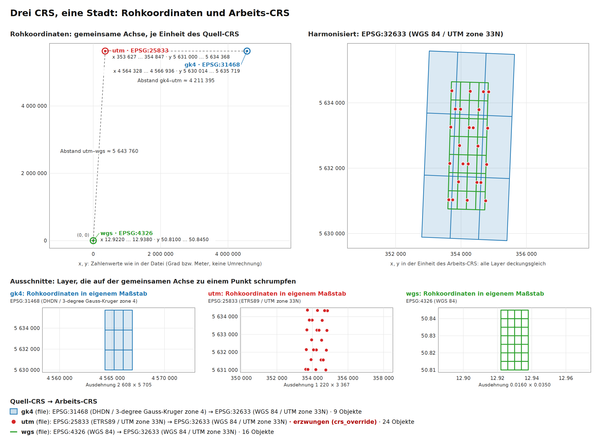

# Drei CRS, eine Stadt

Schaufenster-Beispiel für das deklarierbare Arbeits-CRS (FA55), die Regionsprüfung
(FA56), die geprüfte Reprojektion (FA57) und die CRS-Provenienz mit dem Vergleichsplot
`crs_plot` (FA58).

```
uv run geofact validate examples/crs_showcase/drei_crs_eine_stadt.yaml
uv run geofact run examples/crs_showcase/drei_crs_eine_stadt.yaml
```

Der Lauf braucht kein Netz (Region als BBox-Literal, nur lokale Dateien) und dauert
wenige Sekunden. Die Ausgaben landen in `output/drei_crs_eine_stadt/`.

## Daten

Drei kleine, synthetische Datensätze desselben Ausschnitts von Chemnitz, erzeugt von
`make_data.py` aus dem MIT-Testfixture `tests/fixtures/chemnitz_street_grid.geojson`
(keine OSM- oder Amtsdaten):

| Layer | Datei | Quell-CRS | Rohkoordinaten |
|---|---|---|---|
| `wgs` | `data/chemnitz_strassen_wgs84.geojson` (16 Straßen) | EPSG:4326, Grad | x ≈ 12,93 · y ≈ 50,83 |
| `utm` | `data/chemnitz_haltestellen_utm33.geojson` (24 Haltestellen) | EPSG:25833, Meter – **ohne** `crs`-Angabe in der Datei | x ≈ 354 000 · y ≈ 5 632 000 |
| `gk4` | `data/chemnitz_stadtteile_gk4.shp` (+ `.shx/.dbf/.prj/.cpg`, 9 Stadtteile) | EPSG:31468, Meter (aus der `.prj`) | x ≈ 4 565 000 · y ≈ 5 632 000 |

Die Haltestellen-Datei ist der typische Stolperstein: Ein GeoJSON ohne `crs`-Member
gilt als WGS 84 (RFC 7946), der Leser meldet EPSG:4326 – die Werte sind aber
UTM-Meter. Das Szenario nennt deshalb `crs: "EPSG:25833"` und `crs_override: true`.
Lässt man beides weg, bricht der Lauf mit
`Koordinaten passen nicht zu EPSG:4326` ab, statt Meter als Grad weiterzurechnen
(FA57, Goldene Regel 7). Mit Override meldet der Lauf eine Warnung
„Datei deklariert EPSG:4326 (WGS 84), Konfiguration erzwingt EPSG:25833“.

## Ablauf

Ohne `scenario.crs` gilt der Default `auto`: er wählt die UTM-Zone aus dem Regionszentroid (12,93° O → **EPSG:32633**,
genau wie FA5). Alle drei Layer werden beim Laden dorthin reprojiziert; danach:

1. `puffer` – 100 m um jede Straße (`buffer`),
2. `treffer` – Haltestellen im Puffer (`clip`; 18 der 24, die 6 „abseits“ liegen
   etwa 140 m von jeder Straße entfernt),
3. `je_stadtteil` – Anzahl je Stadtteil (`aggregate`, `count`, `within`).

Ausgaben: Karte (`map`), GeoJSON in **EPSG:25833** (`crs: EPSG:25833` an der Ausgabe,
FA55), CSV (im Arbeits-CRS) und der Vergleichsplot `crs_plot` zweimal: als HTML-Seite
und mit `format: svg` als eigenständige Vektorgrafik.

## Der Vergleichsplot

Eingecheckt unter `abbildungen/`, alle aus demselben Lauf:

| Datei | Zweck |
|---|---|
| [`crs_plot.html`](abbildungen/crs_plot.html) | HTML-Ausgabe des Laufs (`format: html`) |
| [`crs_plot.svg`](abbildungen/crs_plot.svg) | SVG-Ausgabe des Laufs (`format: svg`), 1200 × 888 px, Vektorgrafik |
| [`crs_plot.pdf`](abbildungen/crs_plot.pdf) | dieselbe SVG als PDF (Vektor, Text durchsuchbar) – für `\includegraphics` in LaTeX |
| [`crs_plot.png`](abbildungen/crs_plot.png) | dieselbe SVG als PNG mit doppelter Auflösung (2400 × 1776 px) |



Die Ausgabe ist deterministisch (feste Größe, feste Rundung, keine Zeitstempel): Ein
neuer Lauf erzeugt HTML und SVG bytegleich. PDF und PNG entstehen ohne neue
Python-Abhängigkeit mit Headless-Chrome aus der SVG, z. B.

```
chrome --headless=new --force-device-scale-factor=2 --window-size=1200,888 \
       --screenshot=crs_plot.png crs_plot.svg
chrome --headless=new --no-pdf-header-footer --print-to-pdf=crs_plot.pdf seite.html
```

wobei `seite.html` die SVG per `` einbettet und `@page{size:1200px 888px;margin:0}`
setzt. Alternativ: `inkscape crs_plot.svg --export-type=pdf`.

**Oben links – Rohkoordinaten auf einer gemeinsamen, linearen Achse.** Jeder Layer wird
mit den Zahlen gezeichnet, die in seiner Datei stehen, ohne Umrechnung; die Achse
beginnt im Ursprung (0, 0). Alle drei Datensätze beschreiben dieselben paar
Quadratkilometer, liegen hier aber weit auseinander: die Straßen in Grad (grün) als
Punkt im Ursprung, die Haltestellen in UTM-Metern (rot) bei x ≈ 354 000, die
Stadtteile in Gauß-Krüger-Metern (blau) bei x ≈ 4 565 000 – Gauß-Krüger Zone 4 hat
einen falschen Rechtswert (False Easting) von 4 500 000 m, UTM von 500 000 m relativ
zu einem anderen Mittelmeridian. Jeder Layer trägt ein Etikett mit Quell-CRS und
Rohausdehnung (Etiketten werden versetzt, nie ausgeblendet); gestrichelte Linien
nennen die Abstände als reine Zahlenwerte: gk4–utm ≈ 4 211 395, utm–wgs ≈ 5 643 760
(Grad und Meter gemischt – genau das, was ohne Harmonisierung passieren würde).
Würde man die Daten so verschneiden, gäbe es keinen einzigen Treffer.

**Mitte – Ausschnitte.** Weil jeder Layer auf der gemeinsamen Achse zu einem Punkt
schrumpft, zeigt je ein Ausschnitt seine Rohgeometrien in eigenem Maßstab, mit der
Rohausdehnung an den Achsen (Stadtteile 2 608 × 5 705 m, Haltestellen
1 220 × 3 367 m, Straßen 0,016 × 0,035 Grad).

**Oben rechts – harmonisiert im Arbeits-CRS EPSG:32633.** Nach der Reprojektion
liegen die echten (vereinfachten) Geometrien aller drei Layer deckungsgleich
übereinander: Stadtteil-Flächen (blau) unten, Straßen (grün) darüber, Haltestellen
(rot) oben. Die Stadtteile aus Gauß-Krüger sind in UTM sichtbar gedreht
(Meridiankonvergenz zwischen den Mittelmeridianen 12° und 15°), während sie im
Ausschnitt ihrer Rohkoordinaten achsenparallel sind.

Die Legende nennt je Layer `Quell-CRS → Arbeits-CRS`, die Objektzahl und markiert
`utm` als **erzwungen (crs_override)**. Dieselbe Herkunft steht im Lauf auch im
Ereignis `layer_loaded` (`detail.provenance`) und in `ExecutionResult.provenance`;
die gezeichneten Geometrien (`raw_shapes`/`shapes`) bleiben nur im Speicher und
stehen nicht in Ereignis und Web-Status.

## Ergebnis (synthetische Daten)

| Stadtteil | Haltestellen ≤ 100 m an Straße |
|---|---|
| Sued-West | 1 |
| Sued | 3 |
| Sued-Ost | 1 |
| West | 2 |
| Mitte | 4 |
| Ost | 2 |
| Nord-West | 1 |
| Nord | 3 |
| Nord-Ost | 1 |

## Grenzen

- Daten erfunden; die Zahlen sagen nichts über Chemnitz.
- DHDN → ETRS89 nutzt die Standardtransformation von pyproj (ohne Gitterdatei, etwa
  1 m Genauigkeit) – für einen 100-m-Puffer ohne Belang, für Katastergenauigkeit nicht.
- `crs_plot` zeichnet vereinfachte Geometrien (höchstens 1 000 Objekte und 5 000
  Stützpunkte je Layer, Douglas-Peucker relativ zur Ausdehnung), Raster nur als
  Ausdehnung und Eckpunkte. PDF/PNG erzeugt nicht GeoFACT selbst, sondern ein
  Browser oder Inkscape aus der SVG.
- Test: `tests/e2e/test_crs_showcase_e2e.py`; Daten neu erzeugen mit
  `uv run python examples/crs_showcase/make_data.py`.
